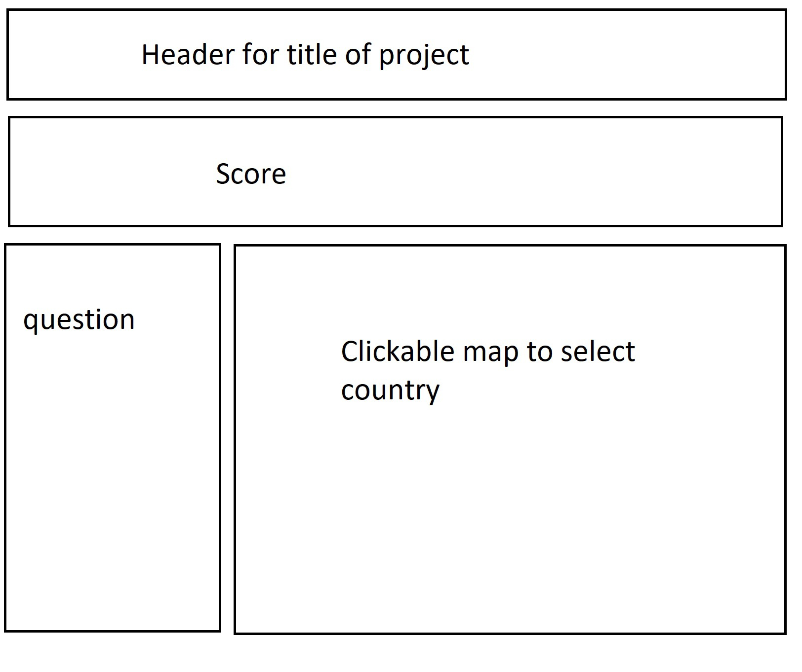
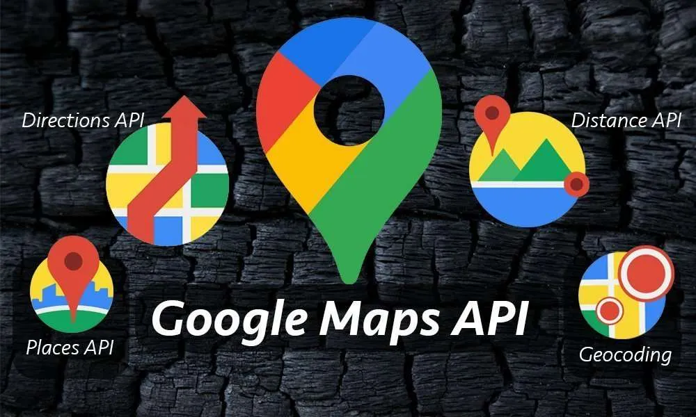
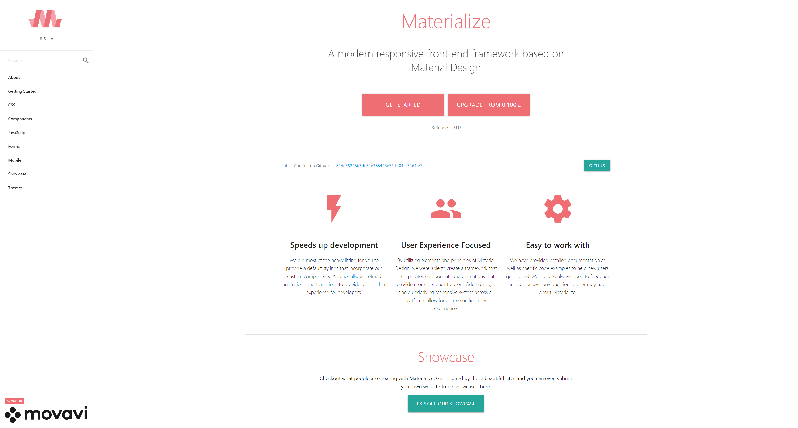

# **Country Quiz**

#### By Zander Merenburg, Bryan Davie, Adam Aronson and William DiStefano.

 
 
 

## What will this application do?

---

 How is your knowledge of the world?  We aim to expand your geographical IQ by testing what you know about various countries.  With this exciting application you may take part in playing a geographical trivia game that will test your worldly wisdom! 

- Explore the world with our interactive map!  
    -   Click on a country to activate it.
    -   Answer the trivia question that pops up!
    -   Check out our cool stats page with interesting information about the highlighted country!
- Keep score and come back for more with our persistent scorekeeper.
- Check out the country's flag.  Which one is the coolest?    

 

Have fun and learn about the world!

 
  
 

## Basic Sketch of application
---
<!--  -->

---

## User Stories

>Given-Playing the game  
>When-I click a country  
>>Then-I get a trivia question about the country  

   

>GIVEN-I answer the question  
>WHEN-I get it right  
>>THEN-add 1 to the right score  
>>Else-add 1 to the wrong score  

 
 

## API's Used:  
---

Trivia API for quiz game portion:
<a href="https://the-trivia-api.com/">The Trvia API</a>  
  

 

Map API for interactive clickable world map: 
<a href="https://developers.google.com/maps">Google Maps API</a>  
 

 
 

## CSS Library Used  
---

 

#### Materialize CSS

<a href="https://materializecss.com/">Visit the Materialize stylesheets site</a>  
 

 

---  

### Task breakdown for production  

* Set up repo for the project  
* Create HTML framework with placeholders for elements to be added to application  
* Design layout using materialize stylesheets
    * Add header with project name and credits
    * Add interactive map to page
    * Add score label to page
    * Add trivia question widget next to map
   

__Potential additional developements__
* Add flags to world map selected country
* Add interesting facts (population, year founded, etc.)
* << If within reason and possible, add spotify top playlist from country >>